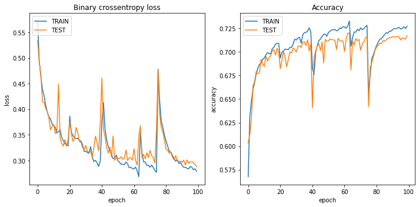

# Satellite Images of Water Bodies - Image segmentation with U-net

### Project
The goal of this project was to use a standard U-net implementation for image segmentation, more specifically, to train the network to recognize and locate bodies of water on the image. 
The starting point for experimenting with the image segmentation task was the popular article _U-Net: Convolutional Networks for Biomedical Image Segmentation_ (https://arxiv.org/abs/1505.04597), which provides a detailed description of the U-net architecture. 
 

### Dataset
A collection of water bodies images captured by the Sentinel-2 Satellite. Each image (128x128) comes with a black and white mask where white represents water and black represents something else but water. 
Data comes from Kaggle: https://www.kaggle.com/datasets/franciscoescobar/satellite-images-of-water-bodies  
The quality of downloaded data was good and did not require additional work with image preprocessing. There are some poor quality photos, but catching them would require manual work, and the project focused on implementing and testing the U-net network. 
Below I have included some sample photos of water bodies with their masks. 
 

### Results
The network uses the standard loss function _binary_crossentropy_ and the _adam_ optimizer. The quality of image segmentation was described by the pixel accuracy measure. 
The learning process is presented in the graphs below. 
 

The results obtained after 100 epochs are shown in the pictures below. 
 
